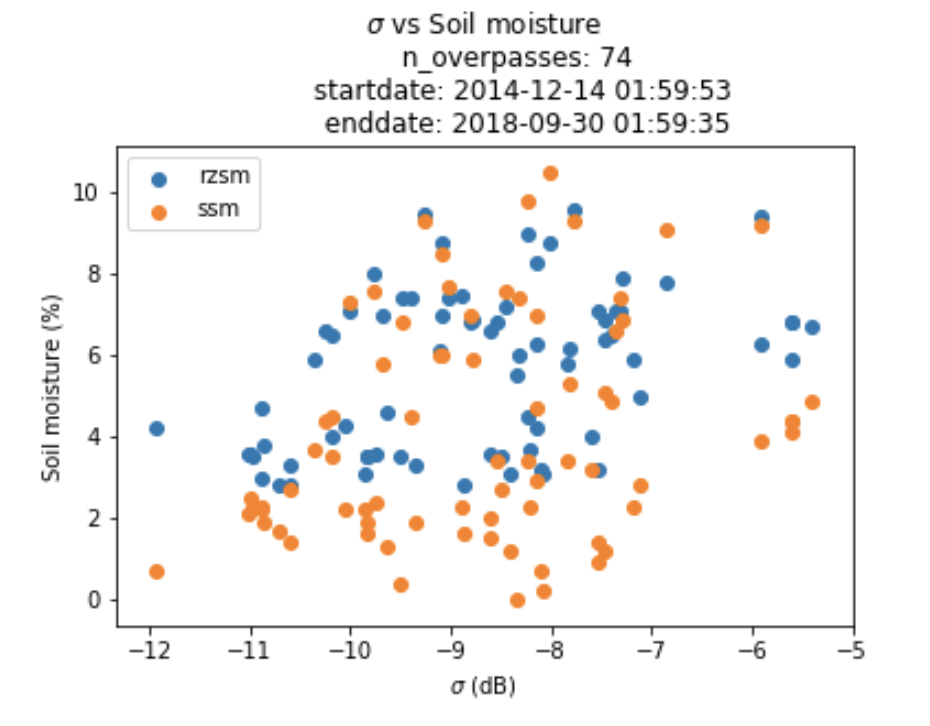

# SAR2RZSM

### Objective: 
Examine relationships between radar backscatter, soil moisture, leaf water potential, and other hydrobiophysical parameters

\
### Introduction
The determination of both Leaf water potential ($\Psi$) and root zone soil moisture from microwave satellite observations has been demonstrated by many studies. These parameters can be retrieved due to the sensitivity of the microwave spectrum to the dielectric constant of water. Studies (1,2) show that can be retrieved via passive microwave observations. While useful, the practical application ofpassive microwave retrievals are inhibited by coarse resolution (ref). Active radar (e.g. Sentinel SAR) offers the potential to retrieve measurements of RZSM at much higher resolution. However, a number of factors complicate this this process, including vegetation, double bounces, and more. 

This study seeks to examine empirical relations between backscatter and biophysical paramters using in Situ SCAN sites as ground truth. 

Pedotransfer Functions 
	Are used to transform measured soil moisture to leaf water potential

Filtering
	Only Ascending S1 orbits are used
	Only soil moisture data without prior 3-day precipitation is used. 

### Data
1. Soil Moisture (response variable, measured in situ):
		Soil Climate Analysis Network data
		List of SCAN sites: https://wcc.sc.egov.usda.gov/nwcc/yearcount?network=scan&counttype=statelist&state=
2. Sentinel-1 C band SAR: 
        Data availability: 2014-10-03 – Present
        Ascending Orbits Only
        Polarizations: VV, HV
3. PRISM precipitation data
		Daily, ... 5-day sums are calculated at each SCAN site to 

### Procedure
        

#### to get the SCAN data
1. Go to https://wcc.sc.egov.usda.gov/reportGenerator/ and build a query with desired columns. 

Once you set the params and hit enter, it's easy to 
auto generate a table of data for a given `site_id` using the following URL and substituting `site_id` where `2218` is:

https://wcc.sc.egov.usda.gov/reportGenerator/view_csv/customMultiTimeSeriesGroupByStationReport,metric/hourly/start_of_period/2218:CA:SCAN%7Cid=%22%22%7Cname/-35315,-11/SMS:-2:value,SMS:-4:value,SMS:-8:value,SMS:-20:value,SMS:-40:value

### Soils data is painful to query

Work around: 
Access soilDB R package and submit bbox query to get the soil "mapunit"

Then use this lookup table which has sand, silt, clay fractions for each map unit: 
http://www.soilinfo.psu.edu/index.cgi?soil_data&conus&data_cov&fract&datasets&lam
        
### Questions and TODO:

1. Sites of interest?
2. Time periods of interest? 
3. Sampling frequency? 
    daily? hourly? 
4. Polarizations? - In general, HV polarization should be best. Why is this again?

